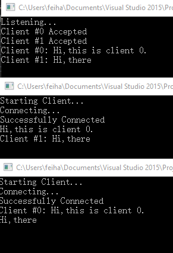

该程序分为一个服务器端和多个客户端

首先在服务端新建一个socket监听4869端口(为什么是4869?你猜),服务端拥有一个客户端向量保存多个来自客户端的连接,每当一个新的客户端连上服务端,就放到该向量里面,然后新开一个线程去处理该请求

处理程序很简单,只需要每当有消息到达时就把该消息广播给客户端向量里面的所有客户端就行了

客户端的话,也是先新建一个socket,然后连接到我们的服务端,每当用户输入消息就直接把它发送给服务端,再新开一个线程去处理服务端发来的消息

在VS2015下面新建一个win32 console application,把代码直接复制进去就能运行了,运行结果如下图,从上到下分别为服务端,客户端1号,客户端2号



Github:[https://github.com/LovelornOwl/socket-chat](https://github.com/LovelornOwl/socket-chat)

服务端代码:

```c++
#include "stdafx.h"
#include <iostream>
#include <winsock2.h>
#include <ws2tcpip.h>
#include <string>
#include <thread>
#include <vector>

#pragma comment (lib, "Ws2_32.lib")

#define IP_ADDRESS "192.168.1.141"//set this to your server ip
#define DEFAULT_PORT "4869"
#define BUFFER_SIZE 1024

struct ClientType {
	int id;
	SOCKET socket;
};

const char OPTION_VALUE = 1;
const int MAX_CLIENTS = 5;

int processClient(ClientType &newClient, std::vector<ClientType> &clientsArray, std::thread &thread);
int main();

int processClient(ClientType &newClient, std::vector<ClientType> &clientsArray, std::thread &thread) {
	std::string message = "";
	char tempMessage[BUFFER_SIZE] = "";

	while (1) {
		memset(tempMessage, 0, BUFFER_SIZE);

		if (newClient.socket != 0) {
			int iResult = recv(newClient.socket, tempMessage, BUFFER_SIZE, 0);

			if (iResult != SOCKET_ERROR) {
				if (strcmp("", tempMessage))
					message = "Client #" + std::to_string(newClient.id) + ": " + tempMessage;

				std::cout << message.c_str() << std::endl;

				for (int i = 0; i < MAX_CLIENTS; i++) {
					if (clientsArray[i].socket != INVALID_SOCKET)
						if (newClient.id != i)
							iResult = send(clientsArray[i].socket, message.c_str(), strlen(message.c_str()), 0);
				}
			}
			else {
				message = "Client #" + std::to_string(newClient.id) + " Disconnected";

				std::cout << message << std::endl;

				closesocket(newClient.socket);
				closesocket(clientsArray[newClient.id].socket);
				clientsArray[newClient.id].socket = INVALID_SOCKET;

				for (int i = 0; i < MAX_CLIENTS; i++) {
					if (clientsArray[i].socket != INVALID_SOCKET)
						iResult = send(clientsArray[i].socket, message.c_str(), strlen(message.c_str()), 0);
				}

				break;
			}
		}
	}

	thread.detach();

	return 0;
}

int main() {
	WSADATA wsaData;
	struct addrinfo hints;
	struct addrinfo *server = NULL;
	SOCKET serverSocket = INVALID_SOCKET;
	std::string message = "";
	std::vector<ClientType> client(MAX_CLIENTS);
	int numberOfClients = 0;
	int tempId = -1;
	std::thread myThreads[MAX_CLIENTS];

	WSAStartup(MAKEWORD(2, 2), &wsaData);

	ZeroMemory(&hints, sizeof(hints));
	hints.ai_family = AF_INET;
	hints.ai_socktype = SOCK_STREAM;
	hints.ai_protocol = IPPROTO_TCP;
	hints.ai_flags = AI_PASSIVE;

	getaddrinfo(static_cast<PCSTR>(IP_ADDRESS), DEFAULT_PORT, &hints, &server);

	serverSocket = socket(server->ai_family, server->ai_socktype, server->ai_protocol);

	setsockopt(serverSocket, SOL_SOCKET, SO_REUSEADDR, &OPTION_VALUE, sizeof(int)); 
	setsockopt(serverSocket, IPPROTO_TCP, TCP_NODELAY, &OPTION_VALUE, sizeof(int)); 
	bind(serverSocket, server->ai_addr, (int)server->ai_addrlen);

	std::cout << "Listening..." << std::endl;
	listen(serverSocket, SOMAXCONN);

	for (int i = 0; i < MAX_CLIENTS; i++) {
		client[i] = { -1, INVALID_SOCKET };
	}

	while (1) {

		SOCKET incoming = INVALID_SOCKET;
		incoming = accept(serverSocket, NULL, NULL);

		if (incoming == INVALID_SOCKET) continue;

		numberOfClients = -1;

		tempId = -1;
		for (int i = 0; i < MAX_CLIENTS; i++) {
			if (client[i].socket == INVALID_SOCKET && tempId == -1) {
				client[i].socket = incoming;
				client[i].id = i;
				tempId = i;
			}

			if (client[i].socket != INVALID_SOCKET)
				numberOfClients++;

		}

		if (tempId != -1) {
			std::cout << "Client #" << client[tempId].id << " Accepted" << std::endl;
			message = std::to_string(client[tempId].id);
			send(client[tempId].socket, message.c_str(), strlen(message.c_str()), 0);

			myThreads[tempId] = std::thread(processClient, std::ref(client[tempId]), std::ref(client), std::ref(myThreads[tempId]));
		}
		else {
			message = "Server is full";
			send(incoming, message.c_str(), strlen(message.c_str()), 0);
			std::cout << message << std::endl;
		}
	} //end while

	closesocket(serverSocket);

	for (int i = 0; i < MAX_CLIENTS; i++) {
		myThreads[i].detach();
		closesocket(client[i].socket);
	}

	WSACleanup();
	std::cout << "Program has ended successfully" << std::endl;

	system("pause");
	return 0;
}
```
客户端代码:

```c++
#include "stdafx.h"
#include <winsock2.h>
#include <ws2tcpip.h>
#include <iostream>
#include <string>
#include <thread>

using namespace std;

#pragma comment (lib, "Ws2_32.lib")
        
#define IP_ADDRESS "192.168.1.141"//set this to your server ip
#define DEFAULT_PORT "4869"
#define BUFFER_SIZE 1024 

struct ClientType {
	SOCKET socket;
	int id;
	char receivedMessage[BUFFER_SIZE];
};

int processClient(ClientType &newClient);
int main();

int processClient(ClientType &newClient) {
	while (1) {
		memset(newClient.receivedMessage, 0, BUFFER_SIZE);

		if (newClient.socket != 0) {
			int iResult = recv(newClient.socket, newClient.receivedMessage, BUFFER_SIZE, 0);

			if (iResult != SOCKET_ERROR)
				cout << newClient.receivedMessage << endl;
			else {
				cout << "recv() failed: " << WSAGetLastError() << endl;
				break;
			}
		}
	}

	if (WSAGetLastError() == WSAECONNRESET)
		cout << "The server has disconnected" << endl;

	return 0;
}

int main() {
	WSAData wsadata;
	struct addrinfo *result = NULL, *ptr = NULL, hints;
	string sentMessage = "";
	ClientType client = { INVALID_SOCKET, -1, "" };
	int iResult = 0;
	string message;

	cout << "Starting Client...\n";

	iResult = WSAStartup(MAKEWORD(2, 2), &wsadata);
	if (iResult != 0) {
		cout << "WSAStartup() failed with error: " << iResult << endl;
		return 1;
	}

	ZeroMemory(&hints, sizeof(hints));
	hints.ai_family = AF_UNSPEC;
	hints.ai_socktype = SOCK_STREAM;
	hints.ai_protocol = IPPROTO_TCP;

	cout << "Connecting...\n";

	iResult = getaddrinfo(static_cast<PCSTR>(IP_ADDRESS), DEFAULT_PORT, &hints, &result);
	if (iResult != 0) {
		cout << "getaddrinfo() failed with error: " << iResult << endl;
		WSACleanup();
		system("pause");
		return 1;
	}

	for (ptr = result; ptr != NULL; ptr = ptr->ai_next) {

		client.socket = socket(ptr->ai_family, ptr->ai_socktype,
							   ptr->ai_protocol);
		if (client.socket == INVALID_SOCKET) {
			cout << "socket() failed with error: " << WSAGetLastError() << endl;
			WSACleanup();
			system("pause");
			return 1;
		}

		iResult = connect(client.socket, ptr->ai_addr, (int)ptr->ai_addrlen);
		if (iResult == SOCKET_ERROR) {
			closesocket(client.socket);
			client.socket = INVALID_SOCKET;
			continue;
		}
		break;
	}

	freeaddrinfo(result);

	if (client.socket == INVALID_SOCKET) {
		cout << "Unable to connect to server!" << endl;
		WSACleanup();
		system("pause");
		return 1;
	}

	cout << "Successfully Connected" << endl;

	recv(client.socket, client.receivedMessage, BUFFER_SIZE, 0);
	message = client.receivedMessage;

	if (message != "Server is full") {
		client.id = atoi(client.receivedMessage);

		thread my_thread(processClient, client);

		while (1) {
			getline(cin, sentMessage);
			iResult = send(client.socket, sentMessage.c_str(), strlen(sentMessage.c_str()), 0);

			if (iResult <= 0) {
				cout << "send() failed: " << WSAGetLastError() << endl;
				break;
			}
		}

		my_thread.detach();
	}
	else
		cout << client.receivedMessage << endl;

	cout << "Shutting down socket..." << endl;
	iResult = shutdown(client.socket, SD_SEND);
	if (iResult == SOCKET_ERROR) {
		cout << "shutdown() failed with error: " << WSAGetLastError() << endl;
		closesocket(client.socket);
		WSACleanup();
		system("pause");
		return 1;
	}

	closesocket(client.socket);
	WSACleanup();
	system("pause");
	return 0;
}
```

